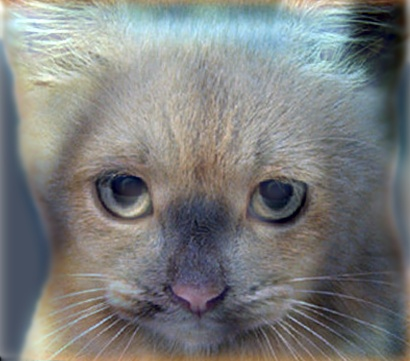
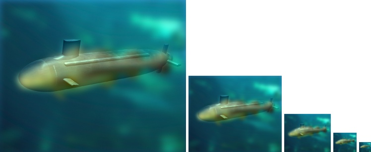

# Chou Huang Chen <span style="color:red">(100000010)</span>

# Project 1 / Image Filtering and Hybrid Images

## Overview
The objective of this project is to create a hybrid image by combining two images with menthod mentioned in a simplified version of the SIGGRAPH 2006 paper by Oliva, Torralba, and Schyns. The hybrid image looks like one image at a distance. When you look up close, then it looks like the other one.
##Approach

The algorithm mentioned in the paper basically use a low-frequency filter to create a low pass filterd image and a high-frequency to create a high pass filtered image. Two filtered images are then combined together to create the hybrid image.

The paper suggests using two cut-off frequencies for two images repectively. In this project, I use one frequency only for both filters. 

```
cutoff_frequency = 7;
```

I use above the standard deviation, in pixels, of Gaussian blur that will remove the high frequencies from one image and remove the low frequencies from another image.

```
filter = fspecial('Gaussian', cutoff_frequency*4+1, cutoff_frequency);
```

##my_imfilter Implementation
Our goal is to implement image filtering function. This function is intended to behave like the built in function imfilter(). This function can:

1. Work for color images.
	*Simply filter each color channel independently.
2. Work for filters of any width and height combination.
	*As long as the width and height are odd (e.g. 1, 7, 9).
3. Work for Boundary handling.
	*The filter can't be centered on pixels at the image boundary without parts of the filter being out of bounds.
	*A better approach is to mirror the image content over the boundaries for padding.

I find two methods to implement my_imfilter function because the first method take all my flash memory and make my computer crashed, so I run this project by the seconde method although it takes longer time than the first.

The working seconde method:

>Step1 To get the size of image and the filter.

```
image_rows = size(image, 1);% rows of image
image_cols = size(image, 2);% cols of image
image_channels = size(image, 3);% channels of image

filter_rows = size(filter, 1);
filter_cols = size(filter, 2);

half_filter_rows = floor(filter_rows/2);% half row of filter 
half_filter_cols = floor(filter_cols/2);% half col of filter

output = zeros(image_rows, image_cols, image_channels);% initial output size first
```

>Step2 Each pixel will be filtered and sum all of them.

```
image = padarray(image, [half_filter_rows, half_filter_cols]);

for channel = 1:image_channels
    for row = 1:image_rows
        for col = 1:image_cols
            output(row, col, channel) = sum(sum(image(row:row+filter_rows-1, col:col+filter_cols-1, channel) .* filter));
        end
    end

end
```

*This method is slower but it do not take up lots of memory.

>I run the session one and session two of proj1_test_filtering.m to test two methods.

<table border=0>
<tr>
<td>my_imfilter(method 1)</td>
<td>my_imfilter(method 2)</td>
</tr>
<tr>
<td>Elapsed time is 0.182343 seconds.</td>
<td>Elapsed time is 1.170535 seconds.</td>
</tr>
</table>


*Hybrid_image:Combine the high frequencies and low frequencies.

>Low_frequencies Image

<tr>
<td>

</td>
</tr>

>High_frequencies Image

<tr>
<td>

</td>
</tr>

>Hybrid_image

```
hybrid_image=(low_frequencies+high_frequencies);
```

*I think the hybrid_image is combined with low frequencies and high frequencies. The high/low frequencies has removed low/high frequencies first, so we combine them in the final process. We don't have to divide two.

<tr>
<td>

</td>
</tr>


## Installation
* Clone the folder to your local desktop
* Install Matlab and open it
* Change the workspace(folder place) to .../yourcomputer/Desktop/DSP_Lab_HW1/Code
* Open pro1.m and clcik the run button or F5 button in keyboard

### Results

<table border=1>
<tr>
<td> 


</td>
</tr>

<tr>
<td>


</td>
</tr>

<tr>
<td>


</td>
</tr>

<tr>
<td>


</td>
</tr>

<tr>
<td>



</td>
</tr>

</table>
